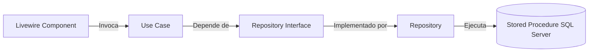
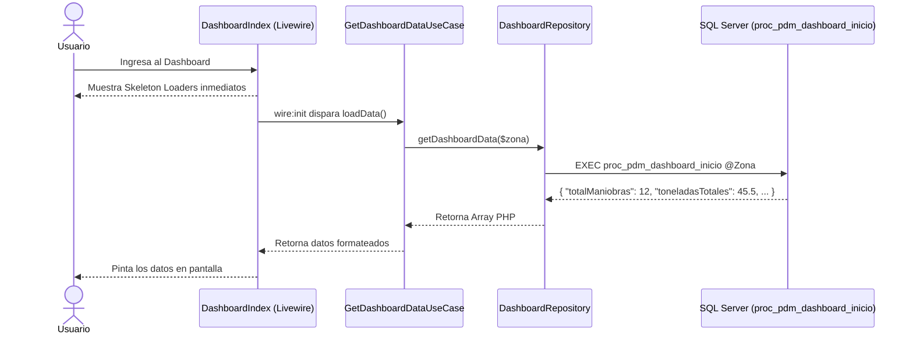

# Módulo de Operaciones - Grupo Impulsora


Sistema administrativo para la gestión de Maniobras, Cuadrillas, Tarifas, Registro de Maniobras y Cortes de Liquidación, integrado con el ERP SAP B1 mediante Stored Procedures exclusivamente.

## 🚀 Arquitectura y Tecnologías

- **Backend:** Laravel 10+, PHP 8.3+
- **Frontend:** Livewire 3.x + Alpine.js + Tailwind CSS
- **Persistencia:** Consumo 100% de Stored Procedures y Vistas de SQL Server / SAP B1 (sin Eloquent, sin migraciones, sin consultas `SELECT` directas a tablas).
- **Patrones de Diseño:** Clean Architecture (Use Cases, Repository Pattern), Atomic Design UI.
- **Testing:** PHPUnit (Mocks organizados independientemente en `tests/Mocks/`).

## 📦 Submódulos

1. **Autenticación (RQM-00)**
   - Autenticación centralizada mediante el Stored Procedure `proc_pdm_login`.
   - Inicialización automática del contexto de sesión (`UsuarioContexto`) incluyendo la zona del usuario (`zonaAsesor`), su rol (`rolAsesor`) y estatus activo.
2. **Dashboard**
   - Resumen estadístico cargado asíncronamente con *Skeleton Loaders*. Optimizado mediante un único SP (`proc_pdm_dashboard_inicio`) que genera y retorna toda la estructura en JSON directamente desde SQL Server.
3. **Catálogo de Maniobras (RQM-01)**
   - ABCC (Altas, Bajas, Cambios y Consultas) de tipos de maniobra utilizando `proc_consultar_tipos_maniobras` y `proc_pdm_administrar_tipos_maniobras`.
4. **Catálogo de Cuadrillas (RQM-02)**
   - Gestión de cuadrillas filtradas por zona y punto de venta utilizando `proc_consultar_cuadrillas` y `proc_pdm_administrar_cuadrillas`.
5. **Tarifas por Cuadrilla**
   - Asignación de hasta 6 conceptos de tarifas (Carga 25kg, Carga 50kg, Descarga 25kg, Descarga 50kg, Traslado, Apaleo) a cada cuadrilla con bitácora de auditoría histórica.
6. **Registro de Maniobras (RQM-03)**
   - Alta manual y consulta con filtros de fecha, almacén, cuadrilla y estado.
   - El estado (*En proceso* / *Liquidada*) se calcula dinámicamente según la asociación a un corte.
   - Exportación a Excel (`ManiobrasExport`) respetando exactamente las columnas, orden y encabezados visualizados en pantalla.
7. **Cortes de Liquidación (RQM-05)**
   - Generación de cortes de liquidación por rango de fechas y zona.
   - Confirmación por cuadrilla y confirmación general.
   - Regeneración de cortes en estado borrador.
   - Vista de detalle, previsualización de reporte en modal y descarga de reportes PDF en formato listo para impresión.

## 📐 Principios de Diseño (Clean Architecture)

El proyecto separa estrictamente las responsabilidades en 4 capas, impidiendo que los componentes visuales interactúen directamente con la base de datos o ejecuten SQL arbitrario:



### Repositorios e Infraestructura
- **Ubicación:** `app/Infrastructure/Repositories/` (`CorteRepository`, `CuadrillaRepository`, `DashboardRepository`, `ManiobraRepository`, `RegistroManiobraRepository`, `SucursalRepository`, `TarifaRepository`, `TarifaAuditRepository`).
- **Mocks de Testing:** Ubicados exclusivamente en `tests/Mocks/` (`MockCorteRepository`, `MockCuadrillaRepository`, etc.), desacoplados del código de producción.

### Sistema de Componentes (Atomic Design)
- **Organismos (Livewire):** Mantienen estado con el servidor (`DashboardIndex`, `CuadrillaIndex`, `CorteIndex`, `CorteDetalle`).
- **Moléculas (Blade + Alpine):** Interactividad 100% cliente sin ida y vuelta al servidor (`x-modal`, `x-confirm-modal`, `pdf-preview-modal`).
- **Átomos (Blade puro):** Elementos visuales estáticos reusables (`x-status-badge`, `x-button`, `x-select`, `x-table-empty-state`).
- **Traits:** Comportamientos reutilizables en servidor (`WithZonaScope`, `WithTableFilters`, `WithDebouncedSearch`).

## 🔄 Diagramas de Flujo

### Flujo del Dashboard (JSON SP)


## ⚙️ Configuración del Entorno local

1. Clonar y configurar `.env`:
   ```bash
   cp .env.example .env
   ```
2. Configurar las conexiones de base de datos en `.env`:
   ```env
   DB_CONNECTION=sqlsrv
   DB_HOST=tu_servidor
   DB_DATABASE=tu_base_de_datos
   DB_USERNAME=sa
   DB_PASSWORD=tu_password
   ```
3. Instalar dependencias de PHP y generar la Key:
   ```bash
   composer install
   php artisan key:generate
   ```
4. Ejecutar la suite de pruebas unitarias/integración:
   ```bash
   vendor/bin/phpunit
   ```
5. Levantar el servidor local:
   ```bash
   php artisan serve
   ```

*(Nota: Este proyecto no utiliza migraciones de Laravel ya que la estructura y persistencia dependen 100% de los Stored Procedures y vistas de SAP B1 en SQL Server administrados por Grupo Impulsora).*

---
Desarrollado para **Grupo Impulsora**.
