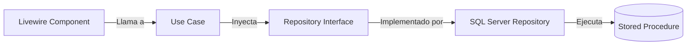
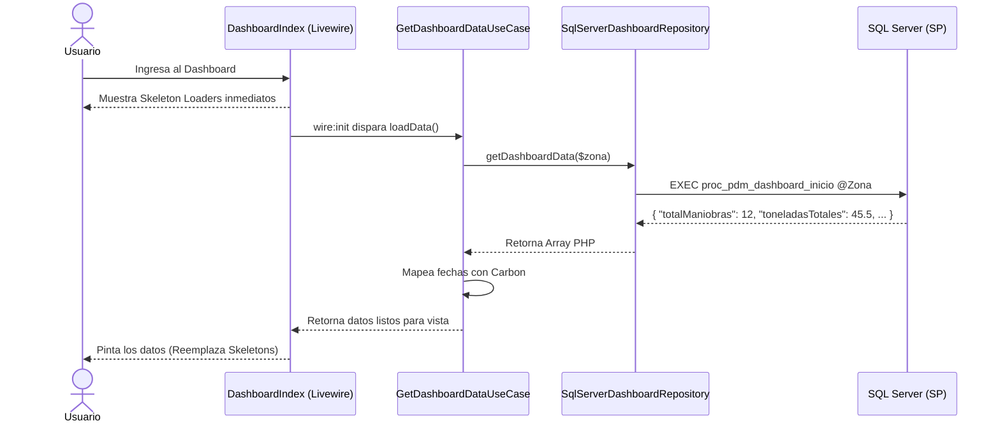

# Módulo de Operaciones - Grupo Impulsora


Sistema administrativo para la gestión de Maniobras, Cuadrillas, Tarifas, y Cortes de Liquidación, integrado con el ERP SAP B1 mediante Stored Procedures.

## 🚀 Arquitectura y Tecnologías

- **Backend:** Laravel 10+, PHP 8.x
- **Frontend:** Livewire 3.x + Alpine.js + Tailwind CSS
- **Persistencia:** Stored Procedures (SQL Server) y Vistas SAP B1 (Sin Eloquent ni migraciones).
- **Patrones de Diseño:** Clean Architecture (Use Cases, Repository Pattern), Atomic Design UI.

## 📦 Submódulos

1. **Dashboard**
   Resumen estadístico cargado asíncronamente con *Skeleton Loaders*. Optimizado mediante un único SP (`proc_pdm_dashboard_inicio`) que genera y retorna toda la estructura en JSON directamente desde SQL Server.
2. **Catálogo de Maniobras**
   ABCC (Altas, Bajas, Cambios y Consultas) de tipos de maniobra.
3. **Catálogo de Cuadrillas**
   Gestión de cuadrillas filtradas por zona y punto de venta.
4. **Tarifas por Cuadrilla**
   Asignación de hasta 6 conceptos de tarifas (Carga, Descarga, Apaleo, Traslado, etc.) a cada cuadrilla con bitácora de auditoría histórica.
5. **Registro de Maniobras**
   Ingreso manual y listado histórico de maniobras ejecutadas por las cuadrillas. El estado (*En proceso* / *Liquidada*) se calcula dinámicamente con base en los cortes. Incluye exportación a Excel.
6. **Cortes de Liquidación**
   *(Próximamente)* Generación de cortes semanales para el pago a cuadrillas, reportes en PDF y exportación.

## 📐 Principios de Diseño (Clean Architecture)

El proyecto separa estrictamente las responsabilidades en 4 capas, impidiendo que los componentes visuales interactúen directamente con la base de datos:



### Sistema de Componentes (Atomic Design)
Se utiliza un enfoque de diseño atómico para optimizar las peticiones de Livewire:
- **Organismos (Livewire):** Mantienen estado con el servidor (`DashboardIndex`, `CuadrillaFormModal`).
- **Moléculas (Blade + Alpine):** Tienen interactividad puramente en el cliente sin llamadas de red (`x-modal`, `x-confirm-modal`, acordeones).
- **Átomos (Blade puro):** Elementos visuales estáticos (`x-status-badge`, `x-button`, `x-currency-input`).
- **Traits:** Comportamientos reutilizables en servidor (`WithZonaScope`, `WithTableFilters`).

## 🔄 Diagramas de Flujo

### Flujo Optimizado del Dashboard (JSON SP)
Para evitar el problema de N+1 consultas o tiempos de carga altos, el Dashboard delega el cálculo y agrupamiento del JSON directamente al motor de SQL Server.



## ⚙️ Configuración del Entorno local

1. Clonar y configurar `.env`:
   ```bash
   cp .env.example .env
   ```
2. Configurar la conexión de la base de datos local (SQL Server) en `.env`:
   ```env
   DB_CONNECTION=sqlsrv
   DB_HOST=tu_servidor
   DB_DATABASE=tu_base_de_datos
   DB_USERNAME=sa
   DB_PASSWORD=tu_password
   ```
3. Instalar dependencias de PHP y generar la Key:
   ```bash
   composer install
   php artisan key:generate
   ```
4. Levantar el servidor:
   ```bash
   php artisan serve
   ```

*(Nota: Este proyecto no usa migraciones de base de datos debido a que consume directamente esquemas de SAP B1 administrados por Grupo Impulsora).*

---
Desarrollado para **Grupo Impulsora**.
