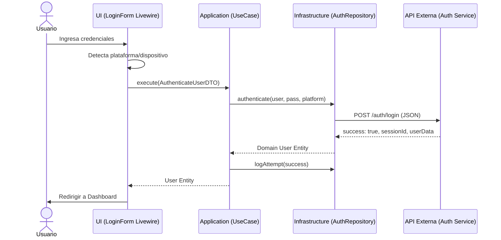
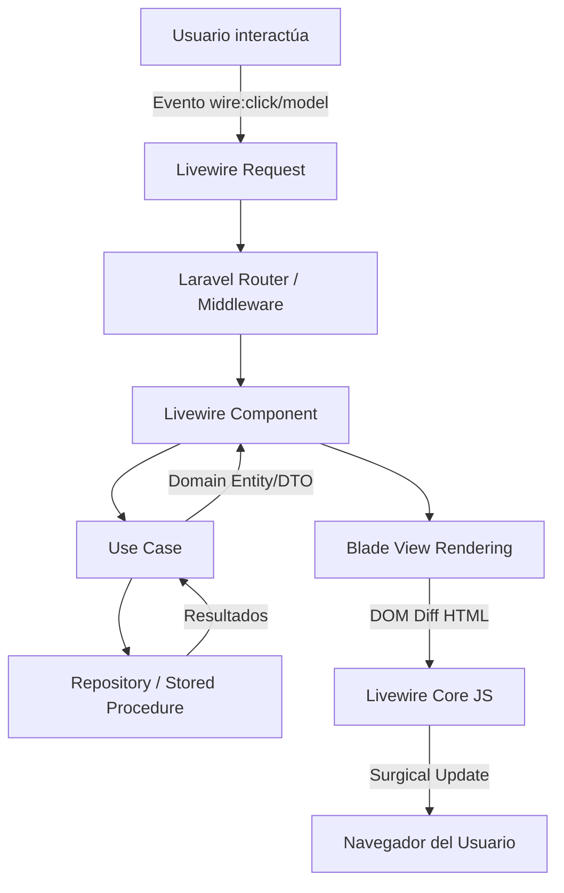
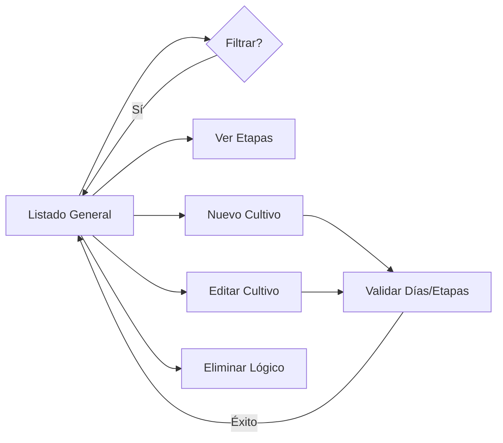
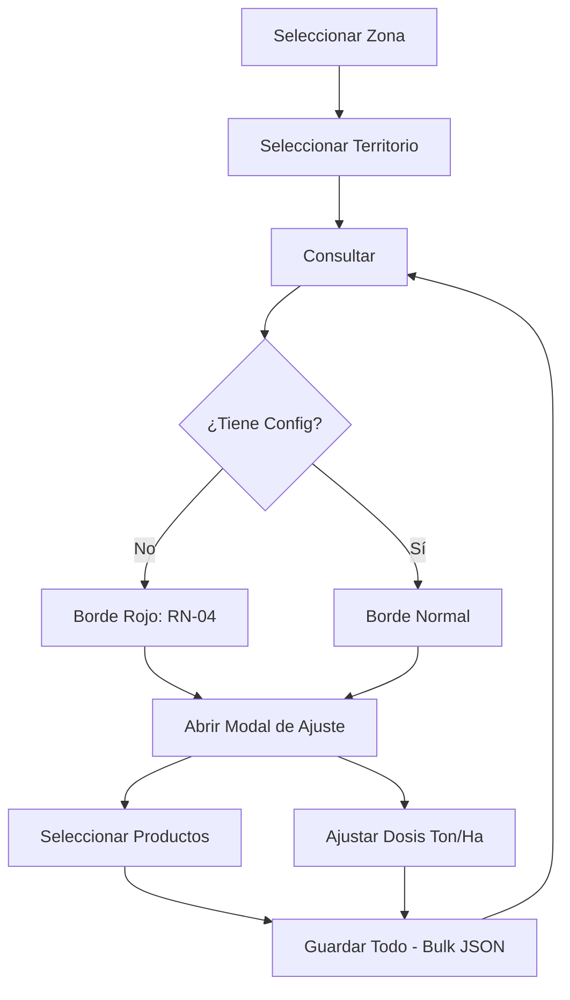

# Administrador Biblioteca de Cultivos


Sistema administrativo para la gestión de cultivos y sus configuraciones de nutrición por zona y territorio.

## Tecnologías

- **Backend:** Laravel 8, PHP 8.x
- **Frontend:** Livewire 3.x + Blade + Tailwind CSS (Atomic Components)
- **Persistencia:** Stored Procedures (SQL Server) vía `DB::select()` / `DB::statement()`
- **Arquitectura:** Clean Architecture (Domain, Application, Infrastructure, UI)
- **Renderizado:** 100% Server-Side Rendering (SSR) con Livewire

## Configuración del Entorno

1. Copiar el archivo de ejemplo y configurar las variables:
   ```bash
   cp .env.example .env
   ```

2. Variables clave en el `.env`:
   - `APP_VERSION`: Versión actual de la aplicación (enviada en login).
   - `AUTH_API_URL`: URL base de la API externa de autenticación.
   - `DB_CONNECTION`: Configuración para SQL Server.

3. Instalar dependencias:
   ```bash
   composer install
   ```

4. Generar la clave de aplicación:
   ```bash
   php artisan key:generate
   ```

## Autenticación y Detección de Plataforma

El sistema detecta automáticamente la plataforma del usuario mediante el `User-Agent` para facilitar la auditoría y compatibilidad con WebViews móviles:
- `IOS_APP` / `IOS_WEB`
- `ANDROID_APP` / `ANDROID_WEB`
- `WEB` (Desktop)

Además, se genera un `deviceId` único por sesión/navegador y se reporta la `versionApp` configurada en el entorno.

## Diagramas de Arquitectura y Flujo

### Flujo de Autenticación
Este diagrama ilustra la interacción entre las capas de Clean Architecture al autenticar un usuario contra la API externa.



### Modelo de Renderizado (SSR)
El proyecto utiliza un modelo de renderizado 100% en el servidor mediante Livewire.



### Flujo: Catálogo de Cultivos
Gestión centralizada de la biblioteca base de cultivos y sus etapas fenológicas.



### Flujo: Configuración de Nutrición
Ajuste de dosis y productos específicos por Zona y Territorio.



## Desarrollo

### Comandos útiles
```bash
# Levantar servidor local
php artisan serve

# Ejecutar tests
php artisan test

# Limpiar caché de configuración y vistas
php artisan config:clear && php artisan view:clear
```

### Reglas de Arquitectura
- **Domain:** Lógica de negocio pura, sin dependencias del framework.
- **Application:** Casos de uso (Use Cases) que orquestan el dominio.
- **Infrastructure:** Implementaciones concretas (Repositorios con SPs, Clientes API).
- **UI:** Componentes Livewire y vistas Blade.

---
© 2026 Administrador Biblioteca de Cultivos.
